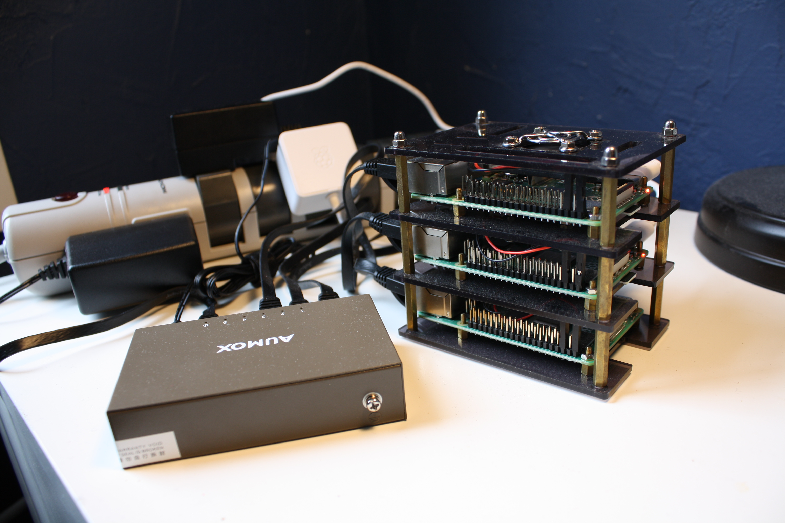

> **DEPRECATION NOTICE:** I'm no longer doing work in this repository; see https://github.com/luketurner/laboratory for the successor project.

# About

This repository has tools and docs for a container-based "personal infrastructure" stack. 

The goal is to let you deploy open-source services & personal projects on your own hardware in the same way you would deploy them in the cloud. There is a deliberate focus on using so-called "cloud-native" tools, including Kubernetes.

If you want a simple solution, steer clear! (Maybe try [Dokku](http://dokku.viewdocs.io/dokku/) instead.)

**Important:** Think of this like a `dotfiles` repository for my homelab, not a polished product offering. All the tooling, scripts, playbooks, etc. have been written for myself. I've published them purely in case someone else finds them interesting.

## Table of Contents

1. [Overview](#Overview)
2. [Raspberry Pi Homelab](#raspberry-pi-homelab)
3. [Deploying services](#deploying-services)

## Background

This README assumes the operator has preexisting experience with DevOps, CI/CD concepts, and container orchestration with Kubernetes.

For additional background, check the following links:

- [Ansible docs](https://docs.ansible.com/ansible/latest/user_guide/index.html)
- [Kubernetes docs](https://kubernetes.io/docs/home/)
- [k3s docs](https://rancher.com/docs/k3s/latest/en/)

# Overview

The following diagram roughly illustrates the different parts of this project and how they relate to each other:

```
┌──────────────────────────────────────────────────────────────┐
│          Application Services and Personal Projects          │
└──────────────────────────────────────────────────────────────┘
┌──────────────┐┌──────────────┐┌──────────────┐┌──────────────┐
│ Data Storage ││  Networking  ││    CI/CD     ││  Monitoring  │
└──────────────┘└──────────────┘└──────────────┘└──────────────┘
┌──────────────────────────────────────────────────────────────┐
│                Container Orchestration (k8s)                 │
└──────────────────────────────────────────────────────────────┘
┌──────────────────────────────┐┌──────────────────────────────┐
│     Pi Homelab Cluster       ││       Cloud Resources        │
└──────────────────────────────┘└──────────────────────────────┘
```

The top box, `Application Services and Personal Projects`, represent the things you actually want to run and use (e.g. Huginn, Nextcloud, etc.) 

The tier below that represents shared services and utilities that provide locally-running versions of common cloud services like S3 or Github. 

Below that is `Container Orchestration (k8s)`. This tier is important because it provides a layer of abstraction that allows applications to be managed and deployed in an automated, "node-agnostic" fashion. It also provides a consistent networking environment, rolling deployments, and other useful features.

Finally, the bottom tier is the "compute." Most of the stuff in this README has been tested on my Raspberry Pi cluster, and I dedicate a section of this README to discussing how to provision a Pi cluster of your own. But I've also used a Digital Ocean managed Kubernetes cluster with good success. In theory, any Kubernetes environment with the appropriate controllers would work.

# Raspberry Pi Homelab

> 
> Photograph of my 3-node Pi cluster. 2/3 of the nodes were provisioned when this was taken.

This section describes setting up a cluster of [Raspberry Pi 4](https://www.raspberrypi.org/products/raspberry-pi-4-model-b/) nodes and provisioning them to run [k3s](https://rancher.com/docs/k3s/latest/en/).

The Pis are a straightforward way to build a quiet in-home cluster, but **this section may be skipped if you prefer different hardware or if you intend to use the cloud.**

To move on to the next section of the README, you just need some kind of Kubernetes cluster you can control with `kubectl`.

## k3s + Pi: Prior Art

I'm not the first person to deploy k3s to Raspberry Pis. When I was working on this project, I referenced a few other folks' build guides that are worth checking out:

- [Will it cluster? k3s on your Raspberry Pi](https://blog.alexellis.io/test-drive-k3s-on-raspberry-pi/)
- [Kubernetes on Raspberry Pi](https://medium.com/@mabrams_46032/kubernetes-on-raspberry-pi-c246c72f362f)

For our purposes, the setup described in those posts has mostly been automated with Ansible, making it possible to efficiently provision multiple nodes at once.

## Software Requirements

The Pis will be running in headless mode, meaning they will be configured entirely over SSH from another computer in the home network.

As a convention to distinguish this computer from other devices on the network, I will refer to it as your _development PC_ or _dev box_.

To use the tools in this repository, your dev box **must be running Linux** and have the following programs installed:

- `ansible` - `apt-get install ansible`
- `sshpass` - `apt-get install sshpass`
- `expect` - `apt-get install expect`
- `kubectl` - [installation instructions](https://kubernetes.io/docs/tasks/tools/install-kubectl/)
- `yq` (tested with 3.3.0) - [download binary](https://github.com/mikefarah/yq/releases/tag/3.3.0)

In addition, it must have an SSH client installed and an SSH key in `~/.ssh/id_rsa`.

> **Tip:** My dev box is a Windows PC with Windows Subsystem for Linux, and it works flawlessly with the tools in this repository. If your dev box runs Windows, I strongly recommend using WSL.

## Buylist

Aside from the dev box, you also need the hardware for the cluster itself.

> **Note:** The below buylist includes product links for example purposes only. I recommend doing some research and planning your own personalized buylist before proceeding. Depending on what you've got lying around already, you might not need to buy everything new.

Assuming you want a cluster of *N* Pis, a baseline buylist would be:

- *N* [Raspberry Pi 4 Model B with 4GB RAM](https://www.raspberrypi.org/products/raspberry-pi-4-model-b/)
- *N* [microSD cards (64 GB)](https://www.amazon.com/dp/B06XX29S9Q)
- *N* [Raspberry Pi 4 official chargers](https://www.raspberrypi.org/products/type-c-power-supply/)
- (*N*+1)-port [gigabit Ethernet switch](https://www.monoprice.com/product?p_id=15762)
- *N*+1 [ethernet cables](https://www.monoprice.com/product?p_id=9544)
- [Cluster case for Raspberry Pi 4](https://thepihut.com/products/cluster-case-for-raspberry-pi) (optional)
- [Power strip w/surge protector](https://www.monoprice.com/product?p_id=11146) (optional)


> **Important:** You can vary the value of *N*, but you should pick an odd number (e.g. 3 or 5), so you can turn on HA for `k3s` using `dqlite`.

It also assumes the following properties about your home network (LAN):

- You have a router that lets you configure LAN subnets, DHCP assignments, and DNS mappings for your home network.

Finally, you may also need an SD card reader in order to flash the microSD cards.

## Flashing the Pis

Before the Pis can be turned on and connected to the network, their microSD cards must be _flashed_ so the Pis can boot and connect to the network.

"Flashing" in this case means the card is partitioned, has filesystems written, and OS files downloaded. The simplest way to achieve this is by connecting the microSD card to your dev box and writing a prebaked disk image to the device. 

There's a variety of tools to flash SD cards with disk images. I used an open-source GUI tool called [balenaEtcher](https://www.balena.io/etcher/), which works cross platform. Eventually I would like to automate this step, though.

Using balenaEtcher, flash the microSD cards with the [Ubuntu 20.02 Server arm64+raspi image](http://cdimage.ubuntu.com/releases/20.04/release/ubuntu-20.04-preinstalled-server-arm64+raspi.img.xz). Flashing a different OS or version may cause the playbooks to fail.

> **Note:** Ubuntu Server was chosen over Raspbian because some Docker images work better in an `arm64` architecture, which Raspbian does not support.

Once you've written the disk image to the microSD card, we need to make one tweak to a file in the boot partition to simplify the next step of provisioning. 

Re-mount the boot partition as a writeable filesystem (in Windows, I just unplug and replug the card reader to do this), then find the `user-data` file and change the `expire: true` line to `expire: false`.

This enables our provisioning script to immediately connect with the default user/pass (`ubuntu`/`ubuntu`) without having to handle password expiry.

## Home Network Setup

Home networks can vary widely, especially among homelab types. This section assumes you have a typical home network, with a single router, a few connected devices, and a fairly standard configuration.

If you're following this README exactly, you should have a separate switch for your Pis, which you can connect to your router according to the following diagram. The Pis are connected to the `Homelab Switch`, which connects to port 4 on the `Router`.

```
               ┌────────────┐                                 
            ┌──│ISP/Modem   │                                 
┌────────┐  │  └────────────┘   ┌────────┐                    
│Router  │  │                   │Homelab │                    
│        │  │                   │Switch  │      ┌────────────┐
│     out│──┘                   │       1│──────│pi1         │
│        │     ┌────────────┐   │        │      ├────────────┤
│       1│─────│Dev box     │   │       2│──────│pi2         │
│        │     └────────────┘   │        │      ├────────────┤
│       2│                      │       3│──────│pi3         │
│        │                      │        │      └────────────┘
│       3│                      │       4│                    
│        │                      │        │                    
│      *4│───────────┐          │       5│──┐                 
└────────┘           │          └────────┘  │                 
                     │                      │                 
                     └──────────────────────┘                 
```


Ideally, the Pis are provisioned with a correspondence between their physical position in the switch, and the address they're allocated on the network, i.e.:

```
switch port 1: ip=x.x.x.1
switch port 2: ip=x.x.x.2
switch port 3: ip=x.x.x.3
```

To achieve this with minimal impact on the rest of the home network, you can configure your router to put port 4 (the port you've connected the switch to) into its own LAN subnet in the `192.168.123.0/24` address space. This is indicated by a `*` next to port 4 in the above diagram.

Also in the router settings, configure the `192.168.123.0/24` subnet to use DHCP addressing starting at `192.168.123.1`, then you can simply connect the devices to the switch one at a time, giving each enough time to connect to the network and reserve an IP address before connecting the next one. For my network, I used the following settings:

|||
|---|---|
|Subnet IP|`192.168.123.0`|
|Subnet mask|`255.255.255.0`|
|DHCP allocation block|`192.168.123.1` -> `192.168.123.253`|
|DHCP gateway|`192.168.123.254`|
|DNS nameserver|`192.168.123.254`|

Later provisioning steps will configure the Pis with static IPs to ensure they are not reassigned.

To summarize, for a three-node cluster, the IP addressing should look like this:

```
┌────────────────────────────────────────────────────────┐
│Home LAN                               ┌──────────────┐ │
│192.168.0.0/16                         │Dev PC        │ │
│                                       │192.168.0.x   │ │
│                                       └──────────────┘ │
│ ┌────────────────────────────────────────────────────┐ │
│ │Homelab Subnet                                      │ │
│ │192.168.123.0/24                                    │ │
│ │                                                    │ │
│ │ ┌──────────────┐ ┌──────────────┐ ┌──────────────┐ │ │
│ │ │pi1 (master)  │ │pi2           │ │pi3           │ │ │
│ │ │192.168.123.1 │ │192.168.123.2 │ │192.168.123.3 │ │ │
│ │ └──────────────┘ └──────────────┘ └──────────────┘ │ │
│ └────────────────────────────────────────────────────┘ │
└────────────────────────────────────────────────────────┘
```

You can pick your own IP addresses or subnet ranges, just remember to change the `inventory.ini` before you run any Ansible playbooks.

For brevity and future-proofness, I strongly recommend creating DNS entries in your router instead of using the IP addresses directly. For a three-node cluster, you'd define the DNS entries as follows:

```
pi1 -> 192.168.123.1
pi2 -> 192.168.123.2
pi3 -> 192.168.123.3
```

> **Note:** My home router does not provide a UI to configure DHCP reservations for LAN subnets, so static IP assignments must be configured in the Pis themselves. If your router software allows it, these could be configured in the router as well.


## Running the Playbooks

Once the Pis are connected to the network and addressable with the `pi1`, `pi2`, and `pi2` DNS names, you should be able to SSH to them using the username `ubuntu` and password `ubuntu`.

At this point, the rest of provisioning is automated by Ansible playbooks. You must have `ansible-playbook` installed to proceed.

Before you run the playbooks:

1. Look at `inventory.ini` and ensure all the values in there are correct for your local network. I recommend setting `admin_user` to the username you use on your development PC.
2. Ensure you have an SSH key configured in `~/.ssh/id_rsa.pub`. (The playbook is lazy, so the key _must_ have that filename.)

To provision, run:

``` bash
# logs in as ubuntu:ubuntu user, creates your admin user with SSH key, and disables ubuntu user login.
# will not work again after it runs once, since it disables its own login user.
scripts/provision.sh --user

# logs in as your admin user and finishes provisioning the Pis. Will restart the device.
# can be re-run later to reprovision things 
scripts/provision.sh
```

When the playbook finishes, the Pis will be fully provisioned and future management can happen through `kubectl`.

### k3s Configuration

The playbooks mostly deploy k3s using default settings. However, it is somewhat vendored, so it may not be the latest version.

The first host (`pi1`) is the master -- but the playbook will be updated to use the embedded HA w/dqlite feature as soon as it stops segfaulting  when running on my Pi cluster. (see: https://github.com/rancher/k3s/issues/1215)

Notable configuration differences:

- `--flannel-backend` set to `wireguard` (default was `vxlan`)
- These components are disabled: `traefik`, `servicelb`, `metrics-server`, `local-storage`

## Configuring kubectl

I chose to make my own lightweight bash script that downloads cluster information from `pi1` and generates a `~/.kube/config` file for you.

Assuming you've provisioned your Pis with hostnames `pi1`, `pi2`, and `pi3`, you can run the script with:

```
scripts/use_cluster.sh pi1
```

This will generate a new config file based on information downloaded from `pi1`.

> **Note:** If you already have things in your `~/.kube/config`, the script can patch in the new information to the existing config. You have to create a cluster named `pi` and a user named `pi-admin`, and `use_cluster.sh` will populate them with the values it downloads instead of replacing the whole file.

When finished, you should be able to connect to the cluster and see all three nodes:

```
devbox$ kubectl get nodes
NAME   STATUS   ROLES    AGE   VERSION
pi3    Ready    <none>   18m   v1.18.2+k3s1
pi2    Ready    <none>   3m    v1.18.2+k3s1
pi1    Ready    master   24m   v1.18.2+k3s1
```

### Debugging Problems

At times, it takes a while for agents to join the cluster. If you've given it a while and there still appears to be an issue preventing all three nodes from joining the cluster, here are some debugging tips.

These tips all assume you've already SSHed into a Pi and are diagnosing it from within the SSH session.

1. Run `sudo systemctl status k3s` (or `k3s-agent`).
2. To view system logs including k3s service output, run `sudo journalctl -xe`
3. Docker is not available, so to manage containers, use `crictl` and/or `ctr` commands. e.g. `crictl ps` is roughly equivalent to `docker ps`.

# Deploying Services

Once your Kubernetes cluster is up and running, the next step is to provision shared services and application services -- basically everything in these two layers:

```
┌──────────────────────────────────────────────────────────────┐
│          Application Services and Personal Projects          │
└──────────────────────────────────────────────────────────────┘
┌──────────────┐┌──────────────┐┌──────────────┐┌──────────────┐
│ Data Storage ││  Networking  ││    CI/CD     ││  Monitoring  │
└──────────────┘└──────────────┘└──────────────┘└──────────────┘
```

## Note on Storage

Many provisioned services require a persistent filesystem to write their non-ephemeral data. 

Using the dynamic volume provisioning API, Kubernetes makes it possible for services to request storage volumes in a way that's totally independent of _where_ that storage is actually provisioned.

To leverage that feature, services in this repository will always create `PersistentVolumeClaim` resources with no `storageClass`. Thus, you **must decide where data is persisted** by configuring a [default StorageClass](https://kubernetes.io/docs/concepts/storage/dynamic-provisioning/#defaulting-behavior).

`k3s` comes with a default dynamic provisioner backed by local disk, meaning by default services will automatically persist data to the nodes themselves. This is convenient for getting started.

If you have a NAS device, you can use that as the default provisioner. I haven't got a NAS yet, though.

In a cloud environment, the default provisioner should be swapped to some block storage cloud service.

## Note on Ingress

Services that want to expose routes to the outside world do so with `Ingress` resources. These resources must be handled by your choice of ingress controller in order for services to be exposed to the Internet.

Running in the cloud, you'd want to pick the ingress controller that corresponds to the cloud platform you're using (e.g. the AWS ALB controller.)

Running in the homelab, I used the Traefik ingest controller that's bundled with k3s. 

## Deployable Services

The following services are planned for support.

> **Important:** This section is WIP!

### Persistent State Services

To reduce server load, stateful services like databases are reused to the greatest degree posssible. A single instance of the state-providing service is spun up, and all downstream services use that.

Note that when sharing state, the number one priority is to ensure applications/services can run independently, without affecting each other through the shared state. (e.g. in Postgresql, using different databases and users.) If this is not possible, the state should not be shared.

Shared state services are provided for:

* Postgresql (state isolation via databases)
* Minio (state isolation via top-level folders, aka buckets)
* Redis? (state isolation via key prefixing)

### Networking Services

These services provide shared networking facilities.

- Ingress (traefik, bundled with k3s by default)

### CI/CD Services

My hope is to eventually deploy everything using a bootstrapped CI/CD pipeline that can deploy code changes to the local cluster without Internet access. For that, the following services are needed:

* Gitea (for hosting source code)
* Concourse (for executing CI/CD actions)
* Docker registry (for storing Docker images in an air-gap)

### Monitoring Services

* Log aggregator?
* System / container metrics - Prometheus?
* Dashboards - Grafana?

### Application Services

Application services are those things which actually provide benefit to the operator, outside of just making it easier to manage the cluster. They are the raison d'etre for this cluster/project.

* Huginn (task running thingy)
* Fathom Analytics (open-source, private analytics for my websites)
* SyncThing or some other backup/sync solution
* OwnCloud / NextCloud / ?
* Smart home automation
* Miniflux feed reader
* Personal project hosting